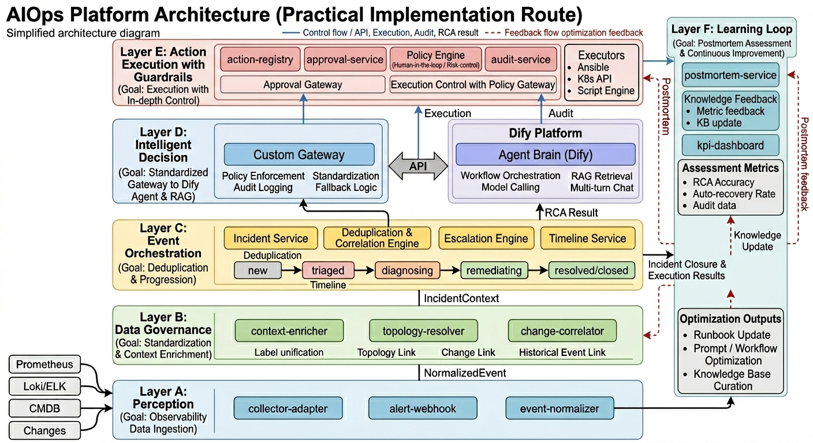

# AIOps 智能运维平台：产品架构与商业化方案

## 1. 文档目标

本文档用于统一 AIOps 项目的技术架构、产品形态与商业化方向，作为：

- 研发设计与实施的基线文档
- 管理层立项评审与资源投入依据
- 面向客户的产品方案与售前材料母版

同时用于小团队条件下的范围控制与里程碑落地，确保先做成可用 MVP，再逐步扩展。

---

## 2. 产品定位与愿景

### 2.1 产品定位

面向中大型企业（金融、政务、制造、互联网）的 **企业级智能运维平台**，以“告警降噪 + 智能诊断 + 自动化自愈”为核心能力，帮助客户显著降低 MTTR、提升稳定性并实现运维能力沉淀。

### 2.2 产品愿景

构建“**感知 → 响应 → 决策 → 恢复 → 学习**”的智能闭环，形成可持续优化的运维中枢。

### 2.3 核心价值主张

- 从“人肉看告警”升级为“语义级事件治理”
- 从“专家经验驱动”升级为“知识库 + Agent 协同决策”
- 从“手工处置”升级为“可控自动化执行”
- 从“单点工具”升级为“私有化、可审计、可扩展的平台能力”

---

## 3. 目标客户与典型场景

## 3.1 目标客户画像

- 业务系统复杂：微服务/K8s/数据库/中间件并存
- 故障影响高：停机损失大、SLA 约束严
- 合规要求高：偏好私有化部署和全链路审计
- 运维团队压力大：告警量高、专家资源稀缺

### 3.2 典型应用场景

1. **夜间告警风暴治理**：分钟级完成去重、归并、关联。
2. **跨系统故障定位**：结合指标、日志、历史 SOP 自动生成 RCA。
3. **低风险故障自动自愈**：如 Pod 重启、HPA 扩容、服务摘流。
4. **运维知识沉淀**：将案例和处置过程沉淀为可检索 SOP。

---

## 4. 产品形态设计

### 4.1 产品形态（建议）

- **平台版（私有化）**：面向大型客户，支持本地部署与深度集成。
- **增强模块版**：在现有监控体系上增配“诊断与自愈模块”。
- **行业方案版**：金融版、政务版、制造版，提供行业预置 SOP 与策略模板。

### 4.2 角色与工作台

- **NOC/L1 运维**：告警收敛、工单联动、建议执行。
- **SRE/L2-L3**：RCA 验证、处置策略编排、规则优化。
- **运维负责人**：SLA、MTTR、团队效率与风险看板。
- **安全/审计**：审批、权限、操作留痕、审计报表。

### 4.3 产品功能包

| 功能域 | 核心能力 | 输出价值 |
| --- | --- | --- |
| 告警治理 | 去重、分组、抑制、路由、拓扑关联 | 降噪、聚焦关键事件 |
| 智能诊断 | 指标/日志联查、RAG 检索、RCA 生成 | 缩短定位时间 |
| 自愈执行 | 自动化脚本/Playbook、审批流、回滚 | 降低恢复时延 |
| 知识中枢 | SOP 管理、向量检索、案例复盘 | 经验资产化 |
| 治理与审计 | 权限分级、策略控制、全链路审计 | 可控合规 |

### 4.4 小团队 MVP 范围（6 个月）

**本期必须做（In Scope）**

- 事件中心：告警接入、去重分组、状态机流转
- Agent 诊断：基于 Dify 的诊断工作流与结构化 RCA 输出
- RAG 知识库：SOP 文档入库、检索、引用证据输出
- 自愈执行（低风险）：重启/扩容等白名单动作 + 审批闸门
- 平台看板：MTTR、告警处理时长、RCA 准确率、自动恢复率

**本期暂不做（Out of Scope）**

- 全量 APM 能力替代（Trace 全栈深度分析）
- 复杂多租户计费与全功能商业化后台
- 全行业模板一次性覆盖
- 全自动高风险故障处置（默认人工审批）

### 4.5 职责矩阵（RACI）

| 工作项 | 前端工程师 | 后端工程师 | AI 工程师 | 运维/平台工程师 | PM |
| --- | --- | --- | --- | --- | --- |
| 事件中心与详情页 | R | C | C | I | A |
| Incident API 与状态机 | C | R | I | C | A |
| Dify 工作流与 RAG | C | C | R | I | A |
| 工具层 Python 服务 | I | C | R | C | A |
| 执行网关与审批流 | C | R | C | C | A |
| 审计中心与报表 | C | R | I | C | A |
| 故障注入测试与验收 | C | C | C | R | A |

说明：R=Responsible（负责执行），A=Accountable（最终负责），C=Consulted（协作），I=Informed（知会）。

---

## 5. 总体技术架构（路线 A 详细版）

当前内部统一参考图为 `AIOps_Practical_Route_Architecture.png`。这张图是路线 A 的逻辑架构图，重点回答“事件如何进入平台、如何形成诊断、如何受控执行、如何回流学习”，而不是回答“每个服务最终部署在哪台机器上”。



配套逐层说明文档见 `AIOps_Architecture_Diagram_Explanation.md`，可用于理解图中每一层为何存在、模块之间如何一一对应，以及这张图是如何从产品目标推导出来的。

路线 A 已从“增强版”升级为“可落地版”：

- 平台核心链路（事件流转、审批审计、执行控制）自研
- Dify 作为 Agent + RAG 中枢，通过 API 向平台开放能力
- 各层解耦，后续可平滑替换模型或 Agent 框架
- 图中展示的是逻辑能力分层，MVP 阶段允许多个模块合并实现

## 5.1 架构图阅读说明与分层（职责到模块级）

### 这张图是怎么来的

- 从 AIOps 的闭环目标倒推：采集、治理、编排、诊断、执行、学习。
- 只保留小团队 6 个月内必须落地的模块，把“概念能力”收敛成“可实现组件”。
- AI 能力放在 `Dify Platform + Agent Brain`，但执行仍必须经过审批、策略和审计约束。
- 因此形成 `Layer A -> Layer F` 六层逻辑：数据接入、上下文补齐、事件成案、AI 判断、受控执行、复盘学习。

### 架构图怎么读

- 自下而上看主链路：`NormalizedEvent -> IncidentContext -> Incident -> RCA Result -> Incident Closure & Execution Results -> Knowledge Update`
- 蓝色实线表示主控制流 / API 调用 / 执行 / 审计；红色虚线表示复盘反馈与知识优化闭环
- 左侧和中部偏事件主链路，顶部偏执行治理，右侧偏学习与持续优化

### 图中名称与实现模块映射

| 图中展示名 | 实现模块/建议 | 作用 |
| --- | --- | --- |
| `collector-adapter` / `alert-webhook` / `event-normalizer` | 保持一致 | 接收并标准化多源告警 |
| `context-enricher` / `topology-resolver` / `change-correlator` | 保持一致 | 做标签统一、拓扑与变更关联 |
| `Incident Service` | `incident-service` | 统一 Incident 生命周期 |
| `Deduplication & Correlation Engine` | `dedupe-group-engine` + 关联规则 | 告警去重、分组、归并 |
| `Custom Gateway` | `platform-dify-gateway` 或平台代理层 | 封装 Dify 调用、结果标准化、审计打点 |
| `Agent Brain (Dify)` | Dify 工作流 + RAG | 诊断、推理、检索、建议 |
| `Approval Gateway` / `Execution Control with Policy Gateway` | `approval-service` + `execution-gateway` + `policy-engine` | 审批、策略校验、执行控制 |
| `Knowledge Feedback` / `kpi-dashboard` | `postmortem-service` + `knowledge-feedback-worker` + `kpi-dashboard` | 复盘、知识更新、指标评估 |

### A. 感知层（Observability Ingestion）

- 数据源：Prometheus、Alertmanager、Loki/ELK、CMDB、K8s Event、变更系统。
- 核心模块：`collector-adapter`、`alert-webhook`、`event-normalizer`。
- 产出对象：统一事件 `NormalizedEvent`（含 source、severity、labels、fingerprint）。

### B. 数据治理层（Normalization & Context）

- 核心职责：统一标签、拓扑关联、变更关联、历史事件关联。
- 核心模块：`context-enricher`、`topology-resolver`、`change-correlator`。
- 产出对象：`IncidentContext`（服务、依赖、变更、近期同类故障）。

### C. 流转编排层（Event Orchestration）

- 核心职责：去重分组、关联归并、状态机流转、升级通知、时间线沉淀。
- 核心模块：`incident-service`、`dedupe-group-engine`（对应图中 `Deduplication & Correlation Engine`）、`escalation-engine`、`timeline-service`。
- 状态机：`new -> triaged -> diagnosing -> remediating -> resolved/closed`。

### D. 智能决策层（Agent Brain, Dify）

- 图中展示为 `Custom Gateway + Dify Platform + Agent Brain (Dify)`。
- Dify 负责：工作流编排、模型调用、RAG 检索、多轮对话。
- 平台负责：通过 `platform-dify-gateway` 或平台代理层封装 Dify 调用、结果标准化、审计留痕与兜底逻辑。
- 核心输出：`RCA Result`（结论、置信度、证据链、影响范围、建议动作）。

### E. 执行与控制层（Execution & Guardrail）

- 核心职责：动作执行、审批闸门、策略控制、权限分级、回滚与审计。
- 核心模块：`action-registry`、`approval-service`、`policy-engine`、`execution-gateway`、`audit-service`。
- 图中的 `Approval Gateway` + `Execution Control with Policy Gateway` 对应实现上的审批流、策略引擎与执行网关组合。
- 执行器：Ansible、K8s API、脚本引擎（统一封装在 `execution-gateway` 后）。

### F. 学习与评估层（Learning Loop）

- 核心职责：复盘反馈、知识更新、评估看板、持续优化。
- 核心模块：`postmortem-service`、`knowledge-feedback-worker`、`kpi-dashboard`。
- 关键指标：MTTR、RCA 准确率、自动恢复率、人工驳回率。
- 关键输出：Runbook Update、Prompt / Workflow Optimization、Knowledge Base Curation。

## 5.2 部署拓扑（小团队可运维）

- 控制平面：`frontend` + `backend-api` + `incident-service` + `approval-service`
- AI 平面：`dify-api` + `dify-worker` + `vector-db`
- 数据平面：`postgres`（业务数据）+ `redis`（缓存与去重窗口）+ `kafka/nats`（事件总线）
- 可观测性平面：`prometheus` + `grafana` + `loki`

建议先单集群部署，按命名空间隔离：`aiops-core`、`aiops-ai`、`aiops-observability`。

## 5.3 路线 A 关键数据流（闭环）

1. 告警进入 `event-normalizer`，生成标准事件。
2. `dedupe-group-engine`（图中 `Deduplication & Correlation Engine`）聚合后生成或更新 Incident。
3. 状态进入 `diagnosing`，平台通过 `Custom Gateway` 调用 `Agent Brain (Dify)` 诊断工作流。
4. Dify 调用平台 Tools（metrics/logs/k8s/change）收集证据。
5. 返回结构化 `RCA Result` 与动作建议，平台按风险策略路由执行。
6. 低风险动作进入执行控制，高风险动作进入审批；结果写入时间线与审计。
7. 事件关闭后自动触发 `postmortem-service` 与 `knowledge-feedback-worker`，更新知识库与 KPI。

## 5.4 路线 A（小团队）技术实现细化

### 核心原则

- 核心事件链路自研（可控）：状态机、升级策略、审批与审计。
- AI 能力通过 Dify 承载（提效）：诊断、RAG、工具编排。
- 平台与 Dify 通过 API 解耦（可替换）：避免绑定单一实现。

### Dify 在本架构中的边界

- Dify 负责：`诊断`、`建议`、`知识检索`、`多轮追问`。
- 平台负责：`状态变更`、`执行授权`、`审计归档`、`SLA 统计`。
- 禁止 Dify 直接改生产资源；所有执行请求必须经 `execution-gateway` 和 `policy-engine`。

### 建议组件分工

- 平台层（前后端自研，对应图中 Layer C / Layer E / 部分 Layer F）：Incident API、状态机、执行控制台、审计中心。
- Dify 层（对应图中 Layer D 的 Dify Platform）：诊断 Agent、RAG 管理、工具调用编排。
- 工具层（Python 服务，对应查询工具与执行器适配层）：metrics/logs/k8s/change 查询与执行器网关。

### 三层项目详细设计

#### 1) 平台层（前后端自研）

**项目目标**

- 建立可控的 Incident 主流程，确保状态流转、审批执行、审计留痕可追踪。

**核心子系统**

- Incident API：事件创建、合并、分派、关闭。
- 状态机引擎：`new -> triaged -> diagnosing -> remediating -> resolved/closed`。
- 执行控制台：动作确认、审批流、执行结果可视化。
- 审计中心：操作日志、状态变更日志、执行审计日志。

**前端功能（你负责重点）**

- 事件列表页：筛选、分组、优先级、责任人。
- 事件详情页：时间线、RCA 卡片、证据引用、影响范围。
- 执行面板：建议动作、风险等级、审批与执行入口。
- 审计查询页：按 incident/operator/action 检索与导出。

**推进计划（建议）**

- Sprint 1：Incident API + 状态机 + 事件列表/详情基础页。
- Sprint 2：执行控制台 + 审批流 + 时间线完整回放。
- Sprint 3：审计中心 + KPI 看板 + 异常处理与告警。

#### 2) Dify 层（Agent 与 RAG 中枢）

**项目目标**

- 提供可解释、可追踪的诊断能力，输出结构化 RCA 与动作建议。

**核心子系统**

- 诊断 Agent 工作流：`incident_diagnosis`。
- 动作规划工作流：`action_planning`。
- 复盘工作流：`postmortem_summary`。
- RAG 管理：SOP 入库、分块、索引、召回与重排。

**必须输出能力**

- 结论（conclusion）
- 置信度（confidence）
- 证据链（evidence）
- 影响范围（impact_scope）
- 动作建议（actions: risk + mode）

**推进计划（建议）**

- Sprint 1：打通诊断工作流，接入 2-3 个基础工具（metrics/logs/k8s）。
- Sprint 2：完善 RAG（标签、重排、引用），稳定结构化输出。
- Sprint 3：加入低置信度降级策略与评测集回归（RCA 准确率、幻觉率）。

#### 3) 工具层（Python 服务）

**项目目标**

- 作为 Dify 与生产系统之间的安全网关，提供标准化查询与受控执行。

**核心子系统**

- 查询工具：`query_metrics`、`query_logs`、`query_k8s`、`query_changes`。
- 执行网关：`execute_action`（统一鉴权、审批校验、回滚控制）。
- 安全治理：限流、超时、重试、幂等键、审计打点。

**推进计划（建议）**

- Sprint 1：完成查询类工具 API，先满足诊断证据采集。
- Sprint 2：完成执行网关，接入 Ansible/K8s API 低风险动作。
- Sprint 3：完善可靠性策略（超时重试/幂等/回滚）与审计标准。

#### 三层协同联调顺序（必须按顺序）

1. 平台层先完成 Incident 状态机与诊断触发入口。
2. Dify 层返回结构化 RCA（先不接自动执行）。
3. 工具层完成查询工具后，补齐证据链。
4. 最后接执行网关与审批流，放开低风险自动动作。

### 平台调用 Dify 的 API 约定（建议）

1. `POST /api/ai/diagnose`：触发诊断工作流，输入 Incident 上下文。
2. `POST /api/ai/chat`：人工追问与补充诊断。
3. `POST /api/ai/tools/{toolName}`：受控工具调用（平台代理）。
4. `GET /api/ai/tasks/{taskId}`：查询异步任务状态与结果。

### 平台核心数据模型（建议）

- `incident`：id、status、severity、service、owner、start_at、end_at
- `incident_timeline`：incident_id、event_type、payload、operator、created_at
- `ai_rca_result`：incident_id、conclusion、confidence、impact_scope、evidence
- `remediation_action`：incident_id、action_name、risk、mode、approval_status、result
- `audit_log`：trace_id、actor、resource、operation、before、after、created_at

### API 契约与版本策略（建议）

- 统一前缀：`/api/v1`
- 版本升级原则：新增字段向后兼容；破坏性变更进入 `v2`
- 字段规范：时间统一 ISO8601，枚举统一小写下划线
- 错误规范：`{ code, message, request_id, detail }`

**核心接口最小集合（MVP）**

- `POST /api/v1/incidents`
- `GET /api/v1/incidents/{incident_id}`
- `PATCH /api/v1/incidents/{incident_id}/status`
- `POST /api/v1/incidents/{incident_id}/diagnose`
- `POST /api/v1/incidents/{incident_id}/actions/{action_id}/approve`
- `POST /api/v1/incidents/{incident_id}/actions/{action_id}/execute`
- `GET /api/v1/incidents/{incident_id}/timeline`
- `GET /api/v1/audit/logs`

### 后端 & AI 联调契约表（JSON 字段级）

#### A. 诊断触发：`POST /api/v1/incidents/{incident_id}/diagnose`

**Request JSON**

```json
{
  "request_id": "req-20260325-0001",
  "incident": {
    "incident_id": "INC-2026-0001",
    "title": "api latency high",
    "status": "diagnosing",
    "severity": "p1",
    "service": "order-service",
    "env": "prod",
    "cluster": "cn-hz-prod-01",
    "fingerprint": "svc:order|alert:latency_p95|env:prod",
    "labels": {
      "team": "sre",
      "region": "cn-hz"
    },
    "started_at": "2026-03-25T09:10:11Z"
  },
  "time_window": {
    "start": "2026-03-25T08:55:00Z",
    "end": "2026-03-25T09:10:00Z"
  },
  "context": {
    "recent_changes": [
      {
        "change_id": "chg-1189",
        "type": "config",
        "summary": "update db pool max",
        "changed_at": "2026-03-25T08:58:00Z"
      }
    ],
    "related_incidents": ["INC-2026-0007"],
    "topology": ["api-gateway", "order-service", "mysql-primary"]
  },
  "policy": {
    "auto_execute_allowed": true,
    "max_actions": 3,
    "confidence_threshold": 0.7
  }
}
```

**Response JSON**

```json
{
  "request_id": "req-20260325-0001",
  "task_id": "task-diag-00091",
  "incident_id": "INC-2026-0001",
  "status": "queued",
  "queued_at": "2026-03-25T09:10:13Z"
}
```

#### B. 任务结果查询：`GET /api/v1/ai/tasks/{task_id}`

**Response JSON（running）**

```json
{
  "task_id": "task-diag-00091",
  "incident_id": "INC-2026-0001",
  "status": "running",
  "progress": 65,
  "steps": [
    {"name": "query_metrics", "status": "done"},
    {"name": "query_logs", "status": "running"}
  ]
}
```

**Response JSON（succeeded）**

```json
{
  "task_id": "task-diag-00091",
  "incident_id": "INC-2026-0001",
  "status": "succeeded",
  "result": {
    "summary": "数据库连接池耗尽导致 API 延迟升高",
    "rca": {
      "conclusion": "连接池参数与突发流量不匹配",
      "confidence": 0.86,
      "impact_scope": ["api-gateway", "order-service"],
      "evidence": [
        {"type": "metric", "ref": "promql://latency_p95"},
        {"type": "log", "ref": "loki://timeout_errors"},
        {"type": "sop", "ref": "kb://sop/db/pool-tuning"}
      ]
    },
    "actions": [
      {
        "action_id": "act-001",
        "name": "临时扩容 order-service",
        "risk": "low",
        "mode": "auto",
        "rollback": "scale down deployment/order-service"
      },
      {
        "action_id": "act-002",
        "name": "调整数据库连接池配置",
        "risk": "medium",
        "mode": "approval",
        "rollback": "restore configmap db-pool-v2"
      }
    ],
    "model_usage": {
      "model": "qwen2.5-32b",
      "input_tokens": 4821,
      "output_tokens": 691,
      "cost_usd": 0.092
    }
  },
  "finished_at": "2026-03-25T09:11:20Z"
}
```

#### C. 追问会话：`POST /api/v1/ai/chat`

**Request JSON**

```json
{
  "incident_id": "INC-2026-0001",
  "task_id": "task-diag-00091",
  "question": "为什么判断是连接池问题而不是下游网络抖动？",
  "conversation_id": "conv-9001",
  "response_mode": "stream"
}
```

**Response JSON（non-stream）**

```json
{
  "conversation_id": "conv-9001",
  "answer": "过去15分钟连接超时错误与连接池使用率峰值高度相关，且网络丢包指标正常。",
  "citations": [
    {"type": "metric", "ref": "promql://db_pool_usage"},
    {"type": "metric", "ref": "promql://packet_loss"}
  ]
}
```

#### D. 工具调用代理：`POST /api/v1/ai/tools/{tool_name}`

**Request JSON（以 `query_metrics` 为例）**

```json
{
  "incident_id": "INC-2026-0001",
  "task_id": "task-diag-00091",
  "arguments": {
    "query": "histogram_quantile(0.95, sum(rate(http_request_duration_seconds_bucket{service='order-service'}[5m])) by (le))",
    "start": "2026-03-25T08:55:00Z",
    "end": "2026-03-25T09:10:00Z",
    "step": "30s"
  }
}
```

**Response JSON**

```json
{
  "tool_name": "query_metrics",
  "status": "ok",
  "data": {
    "series": 1,
    "points": 30,
    "summary": "p95 latency 从 220ms 升至 2.1s"
  },
  "duration_ms": 328
}
```

#### E. 枚举与必填字段约束

- `incident.status`：`new | triaged | diagnosing | remediating | resolved | closed`
- `incident.severity`：`p1 | p2 | p3 | p4`
- `actions.risk`：`low | medium | high`
- `actions.mode`：`auto | approval | suggest_only`
- `task.status`：`queued | running | succeeded | failed | timeout`

**必填字段（后端 -> AI）**

- `incident_id`、`status`、`severity`、`service`、`env`、`fingerprint`、`time_window`

**必填字段（AI -> 后端）**

- `task_id`、`incident_id`、`status`
- 成功时必须包含 `rca.conclusion`、`rca.confidence`、`rca.evidence[]`
- `confidence < 0.70` 时 `actions.mode` 只能为 `suggest_only | approval`

#### F. 错误码约定（联调最小集）

| code | 含义 | 处理建议 |
| --- | --- | --- |
| `AI_TIMEOUT` | AI 任务超时 | 进入人工接管，保留建议模式 |
| `TOOL_UNAVAILABLE` | 工具层不可用 | 降级检索，禁止自动执行 |
| `INVALID_STATE` | 状态机非法跳转 | 拒绝请求并记录审计 |
| `APPROVAL_REQUIRED` | 缺少审批 | 拒绝执行并提示审批人 |
| `SCHEMA_INVALID` | AI 返回结构不合法 | 触发重试/兜底模板 |

### 统一响应结构（建议）

```json
{
  "incident_id": "INC-2026-0001",
  "summary": "数据库连接池耗尽导致 API 延迟升高",
  "rca": {
    "conclusion": "连接池配置与突发流量不匹配",
    "confidence": 0.86,
    "impact_scope": ["api-gateway", "order-service"],
    "evidence": [
      {"type": "metric", "ref": "promql://..."},
      {"type": "log", "ref": "loki://..."},
      {"type": "sop", "ref": "kb://sop/db/pool-tuning"}
    ]
  },
  "actions": [
    {"name": "临时扩容 API", "risk": "low", "mode": "auto"},
    {"name": "调整连接池参数", "risk": "medium", "mode": "approval"}
  ]
}
```

### 失败与降级策略（必须实现）

- Dify 超时：返回最近一次可用建议 + 人工接管提示。
- Tool 调用失败：标记证据缺失，降低置信度并阻断自动执行。
- 执行失败：自动回滚并创建高优 Incident 子任务。
- 向量检索异常：降级到关键词检索 + 近期案例兜底。

## 5.5 调度精度保障（SLO + 规则）

### 调度与响应精度机制

- 状态机强约束：非法状态跳转直接拒绝并记录审计。
- 证据门槛：无证据链 RCA 不允许进入自动执行。
- 置信度门槛：`confidence < 0.70` 时强制降级为建议模式。
- 风险门槛：`risk=high` 必须审批且双人复核。
- 执行前校验：变更窗口、白名单、目标资源健康度。

### 精度验收指标（建议）

- RCA Top1 准确率 >= 80%
- 自动动作误触发率 <= 1%
- 高风险动作审批覆盖率 = 100%
- 事件处理延迟 P95 <= 5 秒

## 5.6 AI 调用成本治理（FinOps）

### 成本控制策略

- 模型分级路由：小模型用于分类/摘要，中模型用于常规诊断，大模型仅复杂故障触发。
- Token 预算：按任务类型设置输入输出上限，超限自动裁剪上下文。
- 缓存复用：同 fingerprint 故障复用历史 RCA 与动作模板。
- 异步化：复盘类任务离线执行，避免占用实时预算。
- 本地优先：可本地推理任务不走外部高价 API。

### 成本指标（建议）

- `cost_per_incident`
- `cost_per_resolved_incident`
- `token_per_incident`
- `mttr_improvement_per_dollar`

## 5.7 测试与验收计划（故障注入）

### 场景清单（MVP 建议 12 个）

- API 延迟飙升
- 数据库连接池耗尽
- K8s Pod OOM
- 节点不可达
- 依赖服务超时
- 配置变更回归故障

### 测试分层

- 单元测试：状态机规则、风险策略、工具适配器
- 集成测试：平台 -> Dify -> 工具层 -> 执行网关全链路
- 压力测试：高并发告警风暴场景
- 演练测试：回滚、审批超时、Dify 超时降级

### 验收标准

- Month 3：10+ 场景联调通过，MTTR 改善 > 50%
- Month 6：低风险自愈率 > 60%，关键 KPI 达标

## 5.8 安全与合规细化

- 密钥管理：统一 KMS/Secret 管理，禁止硬编码
- 权限管理：RBAC 最小权限 + 操作双人复核
- 数据治理：敏感字段脱敏，审计日志保留 >= 180 天
- 网络安全：服务间 mTLS，关键接口 IP 白名单

## 5.9 发布与回滚 Runbook

### 发布策略

- 灰度发布：10% -> 30% -> 100%
- 观测窗口：每阶段观测 30-60 分钟
- 门禁条件：错误率、延迟、误触发率不劣化

### 回滚触发条件

- 自动动作失败率连续 5 分钟超阈值
- Dify 调用超时率超过阈值并影响响应 SLA
- 关键服务错误率超过基线阈值

### 回滚步骤

1. 切换到上一个稳定版本
2. 暂停自动执行，仅保留建议模式
3. 触发应急群通知并生成复盘任务

---

## 6. 非功能与治理要求

### 6.1 平台级 SLO

- 告警处理延迟 P95 < 5 秒
- 诊断建议生成时延 P95 < 60 秒
- 平台可用性 > 99.9%
- 审计日志完整率 100%

### 6.2 安全与合规

- 全链路 RBAC、最小权限原则
- 高风险动作强制审批与双人复核
- 敏感数据脱敏与传输加密
- 全量操作可追踪、可回放、可审计

### 6.3 可靠性设计

- 关键组件高可用（多副本 + 失败转移）
- 执行器幂等与超时控制
- 自愈操作默认可回滚
- 平台自身监控与告警闭环

---

## 7. 行业成功案例与可借鉴能力

本节聚焦可公开验证的产品能力与落地方法，给出“案例细节 + 可复制做法 + 本项目映射”。

### 7.1 PagerDuty：事件响应与值班协同的标杆实践

**产品定位**

- 核心是 Incident Response 平台，不替代监控系统，而是承接监控告警并驱动处置流程。

**能力拆解**

- On-call 与 Escalation Policy：告警按排班与升级链自动触达，避免“没人接警”。
- Event Intelligence：告警去重、聚合、抑制，降低重复告警噪声。
- Incident Timeline：自动记录事件时间线，沉淀复盘证据。
- 协同联动：和 IM、工单、电话短信等系统联动，缩短协作路径。

**典型处置链路（可直接借鉴）**

1. 监控触发告警并推送至事件平台。
2. 平台完成去重与聚合，生成 Incident。
3. 根据值班策略通知责任人；超时未响应自动升级。
4. 故障处理期间持续写入时间线与操作记录。
5. 事件关闭后自动进入复盘，产出改进项。

**对本项目的设计启示**

- 流转层应优先实现：事件状态机、升级规则、值班联动、时间线中心。
- 以“先把流程跑通，再叠加智能诊断”为原则，避免一开始过度依赖模型能力。

### 7.2 Datadog：统一可观测性驱动的关联诊断

**产品定位**

- 统一可观测性平台，强调 Metrics / Logs / Traces / Events 的联动分析。

**能力拆解**

- 跨数据源检索：同一故障上下文中同时查看指标、日志、链路。
- 服务拓扑视图：用依赖关系缩小故障定位范围。
- 异常检测与动态阈值：减少静态阈值带来的误报与漏报。

**典型处置链路（可直接借鉴）**

1. 告警触发后自动关联同时间窗口日志与 Trace。
2. 按服务拓扑定位“上游异常”和“下游受影响面”。
3. 生成诊断候选清单，输出最可能根因路径。

**对本项目的设计启示**

- 数据治理层必须建立统一标签标准（service/env/region/owner）。
- 大脑层工具链应支持多源联查，避免只依据单一指标给结论。

### 7.3 Dynatrace / New Relic：AIOps 根因分析能力建设

**产品定位**

- 强调“自动检测 + 智能诊断 + 影响分析”的连续闭环。

**能力拆解**

- 异常模式识别：识别偏离基线的行为并触发分析。
- 根因候选推理：基于依赖、时序和上下文给出候选原因。
- 影响域评估：输出受影响服务、租户或业务线范围。

**典型处置链路（可直接借鉴）**

1. 监控发现异常并触发自动诊断。
2. 系统聚合证据并排序根因候选。
3. 输出诊断结论、置信度与影响范围，支持人工确认。

**对本项目的设计启示**

- RCA 输出必须包含：结论、证据链、置信度、影响范围、建议动作。
- 建议在模型层增加“低置信度降级策略”（仅建议，不自动执行）。

### 7.4 Splunk SOAR / IBM SOAR：自动化与治理并重

**产品定位**

- 重点在 Playbook 编排、权限管控和审计闭环，适合高合规场景。

**能力拆解**

- 自动化编排：将多步骤处置动作标准化为可复用流程。
- 审批与权限：高风险动作执行前置审批，细粒度授权。
- 审计追踪：保留操作记录、执行结果和责任主体。

**典型处置链路（可直接借鉴）**

1. 命中自动化策略后生成执行计划。
2. 高风险动作进入审批流，低风险动作自动执行。
3. 执行完成后自动记录证据并归档审计。

**对本项目的设计启示**

- 执行层要内置策略闸门：白名单、审批、回滚点、双人复核。
- 任何自动操作都必须可追踪、可回滚、可审计。

### 7.5 开源组合实践：可控、可扩展、可私有化

**推荐基线组合**

- 监控：Prometheus + Alertmanager + Grafana
- 日志：OpenSearch/ELK
- 编排与执行：Argo Workflows / Ansible / K8s API
- 数据采集标准：OpenTelemetry

**实践价值**

- 降低厂商锁定风险，便于私有化与国产化替代。
- 组件化扩展灵活，适合分阶段建设。
- 与现有运维体系兼容度高，迁移成本可控。

**对本项目的设计启示**

- 坚持“开源底座 + 智能中枢”路径，智能层通过连接器与适配层解耦。
- 先做高价值连接器（Prometheus、K8s、工单、IM），再扩展其他生态。

### 7.6 本项目能力映射（Benchmark Mapping）

| 参考产品/方向 | 关键可借鉴能力 | 本项目落地动作 | 近期优先级 |
| --- | --- | --- | --- |
| PagerDuty | 值班升级、事件时间线、响应流程标准化 | 事件状态机 + 升级策略 + 时间线中心 | P0 |
| Datadog | 指标/日志/Trace 联动分析 | 统一标签标准 + 多源联查工具链 | P0 |
| Dynatrace/New Relic | 根因候选、影响范围、置信度输出 | RCA 证据链模板 + 置信度阈值 | P1 |
| Splunk SOAR/IBM SOAR | Playbook、审批治理、审计留痕 | 策略闸门 + 回滚机制 + 审计中心 | P0 |
| 开源生态组合 | 私有化可控、组件化扩展 | 连接器优先级建设 + 模块化部署 | P1 |

### 7.7 里程碑化落地建议（结合本项目 6 个月计划）

- Month 1-2：优先交付 PagerDuty 类能力（事件收敛、升级策略、时间线）。
- Month 2-4：补齐 Datadog 类能力（多源联查、统一标签、拓扑关联）。
- Month 4-5：引入 Dynatrace 类能力（RCA 证据链与置信度输出）。
- Month 5-6：落地 SOAR 类能力（审批、回滚、审计）并完成验收。

---

## 8. 分阶段实施路径（与产品化联动）

### Phase 1（0-3 个月）：MVP 可用

- 打通感知-编排-诊断主链路（平台 + Dify Platform + Custom Gateway）
- 完成 10+ 典型场景故障注入测试
- 输出首版 KPI 看板和实施手册

### Phase 2（4-6 个月）：生产就绪

- 完成执行层与安全闸门
- 实现低风险故障自动自愈
- 完成平台化运维流程（审计、审批、复盘）

### Phase 3（6-12 个月）：规模复制

- 行业模板化交付
- 完善多租户与插件生态
- 按资源情况逐步扩展商业化能力

---

## 9. 主要风险与控制点

| 风险 | 影响 | 控制措施 |
| --- | --- | --- |
| LLM 幻觉或误判 | 错误决策 | 置信度阈值 + 人工审批 + 证据链输出 |
| 知识库质量不稳定 | 诊断命中率下降 | 知识治理流程 + 评分淘汰机制 |
| 自动化误操作 | 业务中断 | 白名单 + 回滚点 + 双人复核 |
| 集成复杂度高 | 项目延期 | 标准连接器 + 适配层抽象 |

---

## 10. 附录：参考案例追踪清单（建议）

为保证方案持续更新，建议在项目推进中维护如下案例追踪清单：

- PagerDuty：事件编排、值班升级、事件复盘能力更新
- Datadog：可观测性联动分析、AIOps 功能演进
- Dynatrace / New Relic：RCA 自动化与影响分析能力
- Splunk SOAR / IBM：自动化编排、安全审批与审计实践
- CNCF 生态：OpenTelemetry、Prometheus、Argo 等开源能力演进
